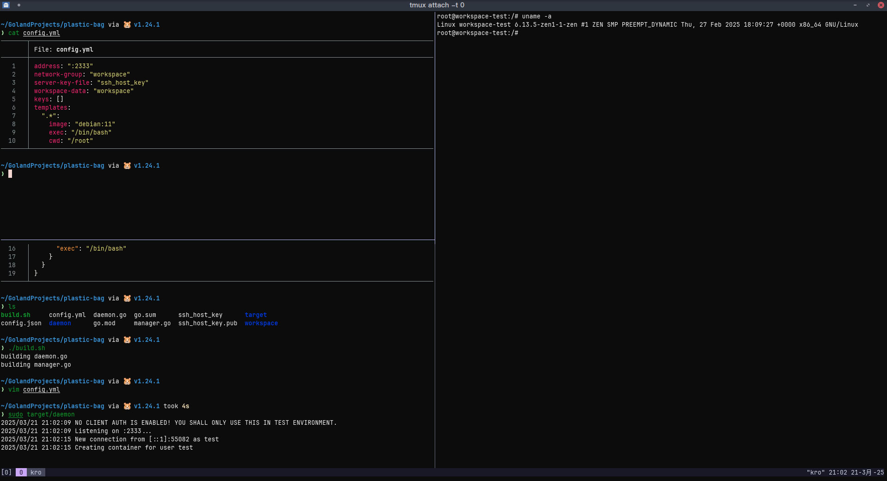

# bubble
[中文](./README-zh.md)  
An SSH daemon that select a Docker container based on your username.  
Work in progress. More tests needed.



# Build
Ensure you have Go 1.24.1 (tested) and Git installed.

```bash
$ git clone https://github.com/iceBear67/bubble
$ bash ./bubble/build.sh
building client.go
building daemon.go
$ ls target
client daemon
```

By default, artifacts are built with CGO disabled, making them runnable without glibc.

# Usage

Access to the Docker socket and a pre-generated SSH private key is required.

```aiignore
$ ./target/daemon
Usage of ./target/daemon:
  -config string
        Path to config file (default "config.yml")
  -help
        Show help
```

Example configuration:
```yaml
# Address for the daemon to listen on. Required.
address: ":2333"

# Newly created workspaces will join this Docker network. Optional.
# If empty, this feature is disabled.
network-group: "workspace"

# Server private key file. Required.
# Generate an SSH key pair via: `ssh-keygen -t rsa -b 4096 -f ssh_host_key -N ""`
server-key-file: "ssh_host_key"

# Newly created workspaces will mount %workspace-data%/%workspace-name% to /workspace. Optional.
# If empty, this feature is disabled.
workspace-data: "workspace"

# List of allowed SSH keys (~/.ssh/authorized_keys).
# If empty, anyone can connect.
keys: []

# Container configurations based on SSH username.
templates:
  ".*":  # Regex matching the username.
    # Pro tip: Build your own workspace image as demonstrated in example/Dockerfile.
    image: "debian:11"

    # The program that runs on every new connection.
    # Pro tip: Use tmux.
    exec: "/bin/bash"

    # Environment variables.
    env:
      - "UID=114514"

    # Remove the container when it stops.
    rm: true
    
    # Enable the manager feature. workspace-data must be present.
    enable-manager: true

    # Enable privileged mode. Required for Docker-in-Docker.
    # Warning: This introduces security risks.
    privilege: true
```

# Client

Once `enable-manager` is enabled，You can use `client` executable to destroy or stop the current workspace.
```bash
$ client
Usage: client <destroy|stop> 
```
